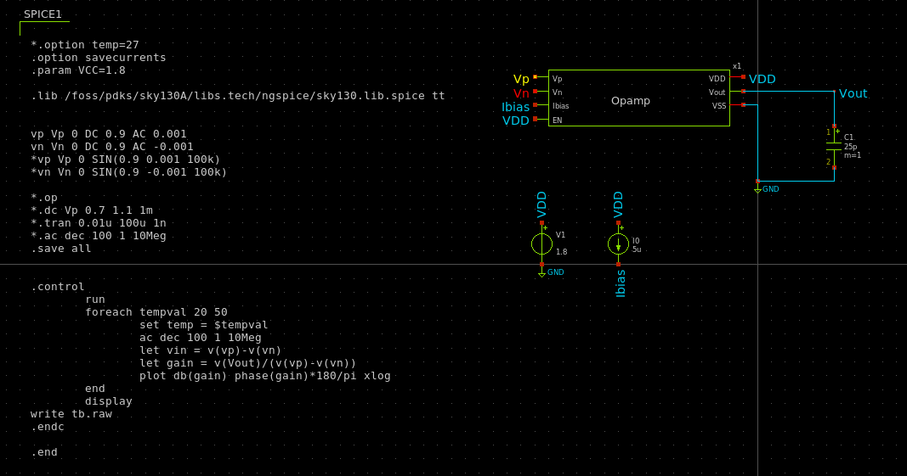

# A Low-power Single-ended Operational Amplifier using Sky130 PDK

This guide provides a reference design for a single-ended op-amp circuit using the SKY130 PDK, intended to function as a non-inverting unity-gain buffer for low-frequency analog signals (1–10 kHz). 

The following figures show the schematic of the circuit and the layout in Klayout.

     
    <em>Figure 1: Schematic</em>

## Project Requirements

| Parameter | Value |
| --- | --- |
| Supply voltage (vdd) | 1.7 V - 1.9 V |
| Nominal input common-mode voltage | (vdd/2 - 0.2V) - (vdd/2 + 0.2V) |
| Output load $C_{L}$ | 25pF (capacitive) |
| Temperature range | 20° C - 50° C |
| Input signal amplitude | $\lt 0.4$ $V_{pp}$ |
| Input signal frequency | 1 - 10 kHz |
| Input bias current | 5 $\mu$ A |
| Open-loop low-freq (DC) Gain | $\geq 60$ dB ($\geq 1000$)|
| Gain bandwidth product GBW | $\geq 1$ MHz |
| Phase margin PM | $\gt 60°$ |
| Quiescent current | $\lt 100$ uA |
| Input offset | $\lt 3$ mV |
| Slew rate SR (open-loop & closed-loop) | $\gt 1 V/\mu$ s |
| Disable current | $\lt 2$ nA |
| Final layout area | within 140 $\mu$ m x 80 $\mu$ m |

## Technology parameters
A detailed explanation of technology parameters can be found here: https://skywater-pdk.readthedocs.io/en/main/index.html

| Parameter | nMOS | pMOS |
| --- | --- | --- |
| $V_{th}$ (V) | 0.49439 | -1.0652 |
| $\mu_0 (\frac{cm^2}{V\cdot s})$ | 301.97 | 24.424 |
| $t_{ox}$ (nm)| 4.148 | 4.23 |

where
$V_{th}$ is the threshold voltage, $\mu_0$ is the carrier mobility and $t_{ox}$ is the oxide thickness.

We also have $\epsilon_{rox} = 3.9$ and the vacuum electrical permitivitty is $\epsilon_0 = 8.8541 \cdot 10^{-12} \frac{F}{m}$. With that we can find $C_{ox}$,

For the pMOS:
$$C_{ox} = \epsilon_0 \cdot \frac{\epsilon_{rox}}{t_{ox}} = 8.163\cdot 10^{-3} \frac{F}{m^2}$$
For the nMOS:
$$C_{ox} = 8.325\cdot 10^{-3} \frac{F}{m^2} $$

## Mathematical calculations

According to the specifications set above, we will have to design the operational amplifier with two stages to achieve the set gain and GBW requirements. Hence, we can initiate our design with a general structure of a two-stage Op-amp and derive the device specific parameters for our custom design. 

More specifically, we need to calculate the W/L ratios of all the transistors, miller capacitor value and the currents in each branch. 

There are several **Rules of thumb** which we can use as starting points along with the equations for calculating different parameters (derivations of these equations can be found from textbooks). 
- $C_{miller}$ $\geq 0.22$ $C_{load}$ for phase margin to be greater than 60. 
- $V_{D,sat}$ $\gt 100$ mV
- $$ g_{m6} \geq g_{m1} $$
- W/L ratio of PMOS in the differential pair is roughly 2.5 times the W/L ratio of NMOS (this is not a hard rule!)

Using the first rule of thumb, 
we can calculate $C_{miller}$ to be $\geq 11$ pF. we can take $C_{miller}$ = 12pF for our calculations (this value could change during simulations).

We can then calculate the minimum bias current sinking from the differential pair ($I_{5}$) using the expected minimum slew rate. It needs to be noted that, in a two-stage Opamp, the slew rate depends on how fast the miller capacitor can be charged and discharged with the current in the differential pair. 

$$ SR = \frac{I_{5}}{C_{miller}} \gt 1 V/ \mu s$$

$$ I_{5} \gt SR * C_{miller} = 12 \ \mu A $$

we can take $I_{5}$= 18 $\mu A.$

With this we can find $g_{m1}$,

$$ GBW = \frac{g_{m1}}{2\pi \cdot C_{miller}} \geq 1$ MHz$$

$$ g_{m1} \geq 75.4 \ \mu S $$

we can assume $g_{m1}$= 80 $\mu S.$

With that know, we can calculate the W/L ratio for the two NMOS transistors in the differential pair. 

$$ \left(\frac{W}{L}\right)\_{1,2} = \frac{g_{m1}^2}{\mu_{0n} \cdot C_{oxn} \cdot I_{5}} $$

Afterwards, we can calculate the W/L ratio of the to PMOS transistors of the differential pair using the relationship 

$$ ICMR_{+} \leq V_{D1,min} * V_{thn,min} $$

Calculate the W/L ratio of M5 using the relation

$$ ICMR_{-} \geq V_{GS1} * V_{D,5}  $$

Calculate the W/L ratios of M6 & M7 considering the current ratios in the two stages. Transconductance of M6 can be considered to be 10 times larger than that of M1 for a good gain. Transistor parameters of the transistors in the current mirror depends on the ratio of currents in each branch.

## Simulations

Following simulations are required to be performed to test if the design meet all the specifications:
- Operating point analysis (both cases when EN = 0 & 1)
- Transient analysis
- Open loop DC gain
- Phase margin & GBW
- Quiescent current
- Input offset
- Slew rate (open-loop & closed-loop)
- PVT variations (Stability and Corner Analysis)
- Monte-Carlo Simulations
 
### Simulation testbench 
Following figures shows the basic simulation testbenches for open-loop and closed-loop simulations seperately. Individual testbenches are derived from these for veryfying each parameter. 

     
    <em>Figure 2: Open-loop testbench</em>

     
    <em>Figure 3: Closed-loop testbench</em>

Following sub sections illustrates the simulation results for each key parameter. 

### Operating Point Analysis

     
    <em>Figure 4: Operating point when enabled</em>

     
    <em>Figure 5: Operating point when disabled</em>

### Transient Analysis

     
    <em>Figure 5: transient analysis for a input sine wave</em>

### Open loop DC gain, Phase Margin and GBW

     
    <em>Figure 6: Open-loop DC gain with GBW and phase margin for input freq of 10kHz</em>

### Slew rate (open-loop & closed-loop)

The slewrate was plotted by giving a positive pulse and a negative pulse respectively to both open-loop and closed-loop scenarios and obtaining the derivative of $V_{out}$. Plots below illustrates the outputs for the four cases. 

     
    <em>Figure 7: Open-loop slewrate for a positive pulse (9.08 V/us)</em>

     
    <em>Figure 8: Open-loop slewrate for a negative pulse (1.3 V/us)</em>

 

     
    <em>Figure 7: Closed-loop slewrate for a positive pulse (5.80 V/us)</em>

     
    <em>Figure 8: Closed-loop slewrate for a negative pulse (1.3 V/us)</em>

### PVT variations (Stability and Corner Analysis)

PVT variation simulations were performed to verify the proper functioning of the design for variations in process corners, supply voltage and temperature within given ranges. Below two plots illustrates the open-loop gain, phase margin and GBW results when tested for fast-fast (ff) and slow-slow (ss) corners under process variations. Other parameters were similarly tested and verified for all three variations. 

     
    <em>Figure 9: Open-loop Gain for ff corners</em>

     
    <em>Figure 10: Open-loop Gain for ss corners</em>

### Monte-Carlo Simulations
Monte-Carlo Simulations yet to be updated. 

